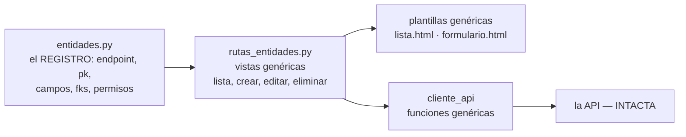

# Plan — Versión 7: el registro de metadatos y las rutas genéricas

## 1. La idea, dibujada

**Ojo:** esto NO es la API genérica descartada — el registro vive en el
FRONT y consume los endpoints por-entidad de siempre.

## 2. Inventario
**Nuevos:** `entidades.py` · `rutas_entidades.py` (blueprint) ·
`templates/entidades/{lista,formulario}.html`.
**Crecen:** `cliente_api.py` (genéricas + es_administrador) · `app.py`
(blueprint, es_admin al entrar, menú por contexto) · `base.html` (menú
desde el registro) · `Program.cs` (version v7).

## 3. Decisiones aterrizadas
- El rol se consulta UNA vez al entrar (`rol-usuario/usuario/{email}`,
  rol 1 = admin) y vive en la sesión.
- FK = select con etiqueta "pk — nombre" (RF2).
- Puentes: ruta especial `/e/<clave>/<a>/<b>/eliminar` — el DELETE de
  pareja exacta de la v3, ahora con botón.
