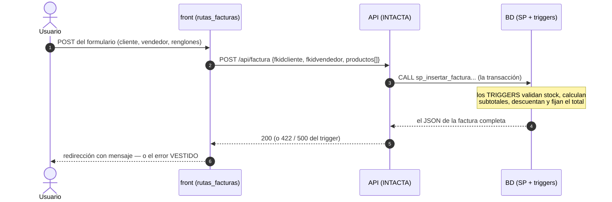

# Plan — Versión 8: la facturación con pantalla

## 1. La secuencia completa (nadie calcula en el camino)

## 2. Inventario
**Nuevos:** `rutas_facturas.py` (blueprint: lista, detalle, crear,
anular) · `templates/facturas/{lista,detalle,formulario}.html`.
**Crecen:** `cliente_api.py` (listar/obtener/crear/anular factura) ·
`app.py` (blueprint) · `base.html` (enlace Facturas) · `Program.cs` (v8).

## 3. Decisiones aterrizadas
- El formulario ofrece **5 renglones fijos** (selects + cantidad): los
  diligenciados viajan; server-side puro, sin JavaScript (D5 de la v6).
- El botón Anular solo existe en facturas ACTIVAS; el 409 igual queda
  cubierto (dos pestañas abiertas) y se muestra vestido.
- Los nombres de cliente/vendedor en la lista NO los busca el front:
  vienen del SP (la API) — cero JOINs en Python.
